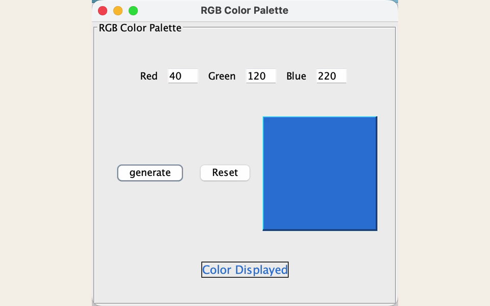

# RGB Color Panel

一个把数字 RGB 输入即时转换为可见颜色的轻量 Java Swing 工具。

[English](README.md)

## 项目概述

RGB Color Panel 是用于理解红、绿、蓝通道组合方式的小型教学项目。输入三个 0–255 数值，即可将数值与最终渲染颜色直接对应比较。

## 截图



截图直接来自运行中的 Swing 工具。

## 功能

- 三个 RGB 通道输入
- 0–255 范围校验
- 即时颜色反馈
- 回车键导航与生成
- 重置控件

## 运行

仓库中的 JAR 已在 Java 25 上验证：

```bash
java -jar RGB-Color-Panel.jar
```

## 项目范围

界面有意保持简单，用最小结构清晰展示一次数据到视觉结果的转换。
